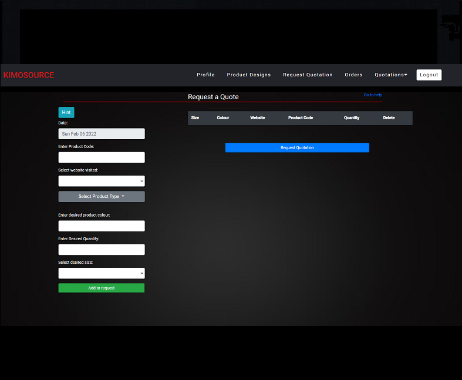

# Brand-IT-Customer

Final Year Project - Online web store for customers to make designs on garments, request a quotation to Admin, make an order and make payment.

## Table of contents

- [Overview](#overview)
  - [The challenge](#the-challenge)
  - [Screenshots](#screenshot)
  - [Links](#links)
- [My process](#my-process)
  - [Built with](#built-with)
  - [What I learned](#what-i-learned)
  - [Continued development](#continued-development)

## Overview

### The challenge

Users should be able to:

- Select the product type
- Design selected product type and save
- Request a quotation

### Screenshots

  
   

  
  
  

   
  

## My process

### Built with

- Angular
- ASP.NET Framework
- MSSQL
- HTML & CSS

### What I learned

### Continued development

## Author

Tshidi Shalang

